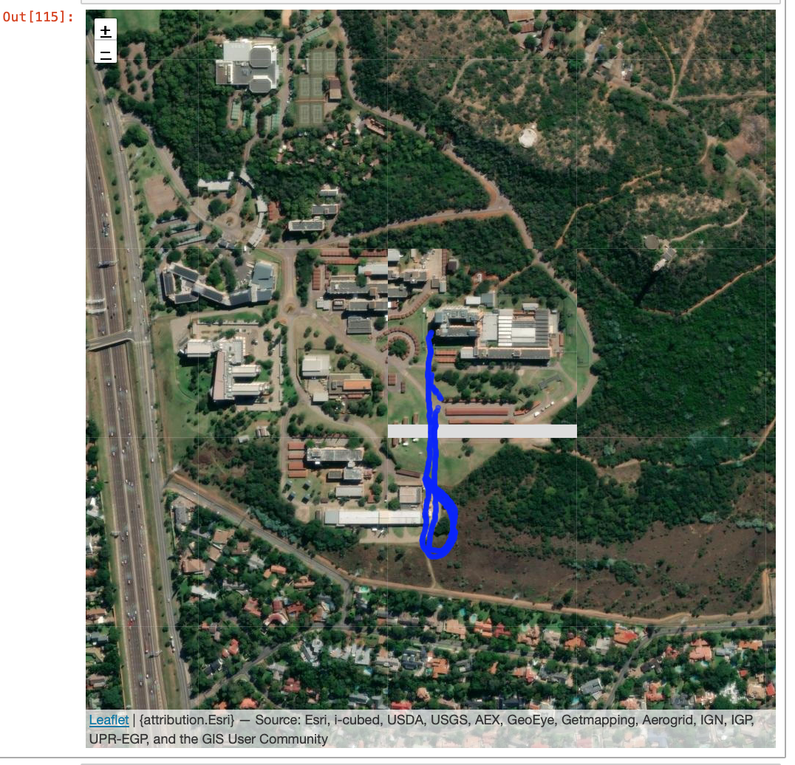

# QstarzGps.jl
Package to load GPS logs from a Qstarz GPS logger into Julia

[](https://github.com/lwabeke/QstarzGps.jl/actions/workflows/CI.yml?query=branch%3Amain)

Qstarz(http://www.qstarz.com/)  produces a number of GPS logger units, which are used in various applications, primarily for racing to record the car position on the track. The author has used some of these loggers to instrument various objects to provide a ground truth of where they moved when observing from the various sensors.

Qstarz provides (at the time this was created Windows-based) tools to extract and analise the recorded GPS logs, particulary for the case of performing repeated circuits on a racing track with the option to export to CSV files. In the author's experiments it was more useful to get the data directly into Julia for analisis and this allows cross-portable OS usage.

This package provides funtionality to reads a QStarz binary log file produced by the BL-1000GT logger in the SESSION\GPSLog\ folder on its internal memory into a array of structure object, which is overloaded to be able to be accessed as structure of arrays.

Steps to use:
1) Install Julia and this package
2) Turn on the BL-1000GT to record positions, while being carried in a pocket or strapped to a vehicle.
3) Ensure that the BL-1000GT is turned off to save the recording
4) Connect to the BL-1000GT using USB
5) Locate the recording in the folder SESSION\GPSLog\ on the device after it has mounted
There will have 3 files generated at the same time when device was turned on and saved when device was turned off.
Bin File Name : *.bin (session.bin / session.poi – log POI waypoint ONLY)
6) Note the filename of the session of interest and load into Julia using the command readQstarzLog

The filename is the date and time of the start of the session. The code in the package has thus far only been tested with the *.bin files


# Acknowledgements

The author wishes to express thanks to Qstarz for providing information about the binary format used by the BL-1000GT, but this work is not directly associated with Qstarz themselves. Any errors in extracting and interpreting the GPS logformat should be blamed on the author and not Qstarz.

The author also wished to express thanks to previous clients who pointed out the Qstarz device to me (I don't have explicit consent to name them explicitly).


# Example

```
julia> using QstarzGps

julia> filename = "230502_120613.BIN"

julia> gpsLog = readQstarzLog(filename)
5325-element Vector{GpsLogEntry}:
 GpsLogEntry(0x03, 0x54, 0x0258, -25.75720058333333, 28.27944851666667, 0x6450fcb5, 6.7598f0, 1423.27f0, 178.39f0, 0.26171875f0, -0.28515625f0, 0.87109375f0, 0x0031, 1.97f0, 1.0f0, 15, 5, 0x01, 90, 0x00000000, 0x00000000)
 GpsLogEntry(0x03, 0x54, 0x02bc, -25.75720188333333, 28.279449366666668, 0x6450fcb5, 7.5006f0, 1423.351f0, 179.87f0, 0.26171875f0, -0.546875f0, 1.2070312f0, 0x0031, 1.97f0, 1.0f0, 15, 5, 0x01, 90, 0x00000000, 0x00000000)
    ...

julia> using Dates

julia> unix2datetime.(gpsLog.time[1:3])
3-element Vector{DateTime}:
 2023-05-02T12:06:13.600
 2023-05-02T12:06:13.700
 2023-05-02T12:06:13.800
```
# Extended Example
From within IJulia notebook:
```

    using QstarzGps, Leaflet, GeoInterface

    filename = "230502_120613.BIN"
    gpsLog = readQstarzLog(filename)
    Lon = gpsLog.dLon
    Lat = gpsLog.dLat

    provider = Leaflet.Esri(:imagery)
    points = GeoInterface.Wrappers.Point.(Lon[1:10:end], Lat[1:10:end])
    layers = Leaflet.Layer.(points, color=:blue)
    m = Leaflet.Map(;  layers, provider, zoom=17, height=1000, center=[Lat[1], Lon[1]])
```

